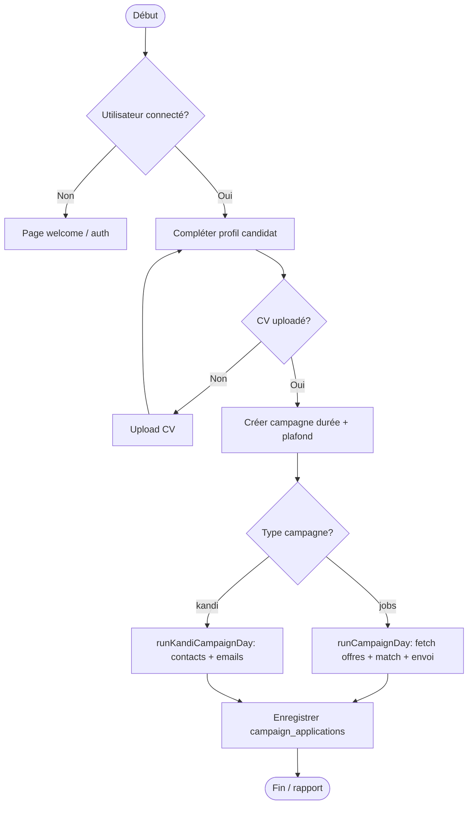
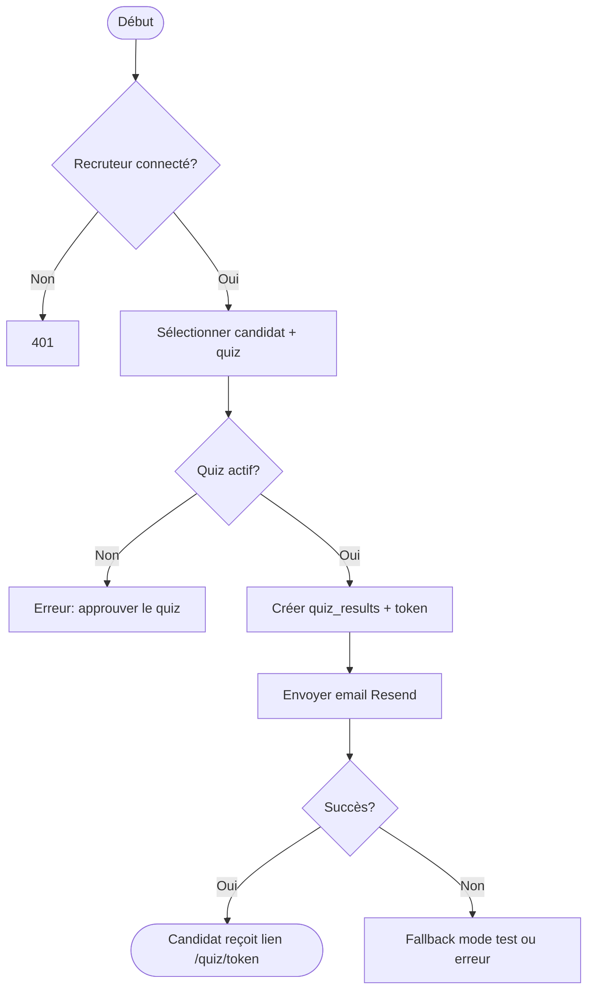

# C1.3 — Architecture fonctionnelle

## 1. Contexte et objectifs

**CareerAI** aide les candidats à structurer leur recherche d’emploi (CV, lettres, suivi) et à **automatiser une partie des candidatures** via des campagnes paramétrées. Un **espace recruteur** permet de gérer des postes, analyser des CV, envoyer des quiz techniques et classer les candidats.

**Objectifs métier :**

- Réduire le temps passé sur les tâches répétitives (recherche d’offres, envoi, relances).
- Garder le contrôle utilisateur (profil, plafonds d’envoi, consentement `allow_auto_apply`).
- Offrir aux recruteurs un outil de présélection (scores, quiz, classements).

---

## 2. Acteurs

| Acteur | Rôle |
|--------|------|
| **Candidat** | Crée un compte, configure son profil, lance des campagnes, consulte le chat IA et le suivi des candidatures. |
| **Recruteur** | Gère des postes, importe des candidats, génère et envoie des quiz, consulte les classements. |
| **Systèmes externes** | Supabase (auth/données), Groq (IA), Resend (emails), agrégateurs d’offres (Adzuna, LBA, France Travail, etc.). |
| **Administrateur / exploitant** | Configure les variables d’environnement, migrations SQL, cron des campagnes. |

---

## 3. Besoins fonctionnels principaux

### Candidat

- Authentification (inscription, connexion, mot de passe oublié).
- Assistant conversationnel (conseils carrière, génération de contenu).
- Builder et export de CV ; gestion de documents (PDF/DOCX).
- **Campagnes** : profil candidat, création de campagne (`jobs` ou `kandi`), exécution manuelle ou cron.
- Suivi des candidatures et statistiques (analytics).

### Recruteur

- CRUD postes (`job_postings`).
- Ajout de candidats (upload CV, analyse IA).
- Génération et envoi de quiz par email (lien token unique).
- Calcul de scores de pertinence et classements par poste.

### Transversal

- Internationalisation FR/EN (contexte `LanguageContext`).
- Application mobile Android (Capacitor → WebView sur careerai.live).

---

## 4. Parcours BPMN (simplifiés)

### 4.1 Lancer une campagne de candidatures

### 4.2 Envoyer un quiz à un candidat

---

## 5. Choix architecturaux et trade-offs

### 5.1 Monolithe Next.js vs microservices

| Option | Avantages | Inconvénients | Choix CareerAI |
|--------|-----------|---------------|----------------|
| **Monolithe Next.js** | Un déploiement, partage de types/logique, latence faible UI↔API | Couplage, scaling vertical du même artefact | **Retenu** — adapté à la taille actuelle de l’équipe et du trafic |
| Microservices | Isolation, scaling indépendant | Complexité ops, réseau, cohérence données | Reporté si montée en charge |

### 5.2 Supabase (BaaS) vs backend PostgreSQL custom

| Option | Avantages | Inconvénients | Choix |
|--------|-----------|---------------|-------|
| **Supabase** | Auth, RLS, Storage intégrés ; time-to-market | Dépendance fournisseur, limites quotas | **Retenu** |
| Backend custom | Contrôle total | Coût de développement auth/RLS/storage | Non retenu en V1 |

### 5.3 Campagnes : email + Puppeteer optionnel

| Option | Avantages | Inconvénients | Choix |
|--------|-----------|---------------|-------|
| Email seul (Resend) | Simple, traçable, peu de maintenance | Pas de soumission sur tous les portails | **Par défaut** |
| + Puppeteer (`ENABLE_BROWSER_AUTOMATION`) | Soumission formulaires web | Fragile (UI change), coût mémoire, légal/ToS | **Optionnel**, désactivé si non configuré |

### 5.4 Mobile : export statique vs WebView distante

| Option | Avantages | Inconvénients | Choix |
|--------|-----------|---------------|-------|
| Export statique + Capacitor | Offline partiel possible | Incompatible avec API Routes dynamiques | Non viable pour CareerAI |
| **WebView → careerai.live** | Réutilise 100 % du produit | Nécessite réseau | **Retenu** — voir [MOBILE-CAPACITOR.md](../MOBILE-CAPACITOR.md) |

---

## 6. Sécurité by design (conception)

Principes intégrés dès la conception :

1. **Séparation client / serveur** — Les secrets (`SUPABASE_SERVICE_ROLE_KEY`, `RESEND_API_KEY`, `GROQ_API_KEY`) ne sont jamais exposés au navigateur ; les routes sensibles passent par `app/api/*` (Node.js).
2. **Authentification** — Supabase Auth + cookies de session ; [middleware.js](../middleware.js) protège les routes applicatives.
3. **Autorisation données** — Row Level Security (RLS) sur PostgreSQL : chaque utilisateur n’accède qu’à ses lignes (`user_id`, `recruiter_id`).
4. **Routes publiques limitées** — Quiz candidat par token, cron protégé par `CRON_SECRET`.
5. **Consentement campagnes** — Flag `allow_auto_apply` sur le profil candidat avant envoi automatique.
6. **Validation entrées** — Contrôles côté API (email, fichiers CV, plafonds campagne).

---

## 7. Liens vers l’implémentation

| Fonctionnalité | Fichiers clés |
|----------------|---------------|
| Campagnes | [backend/services/CampaignService.js](../backend/services/CampaignService.js), [frontend/components/JobCampaigns.js](../frontend/components/JobCampaigns.js) |
| Recruteur | [frontend/components/RecruiterDashboard.js](../frontend/components/RecruiterDashboard.js) |
| Auth | [frontend/contexts/AuthContext.js](../frontend/contexts/AuthContext.js), [middleware.js](../middleware.js) |
| Schéma données | [supabase-schema-saas.sql](../supabase-schema-saas.sql), [supabase-migrations/](../supabase-migrations/) |

Architecture logicielle détaillée : [02-architecture-logicielle.md](02-architecture-logicielle.md).
