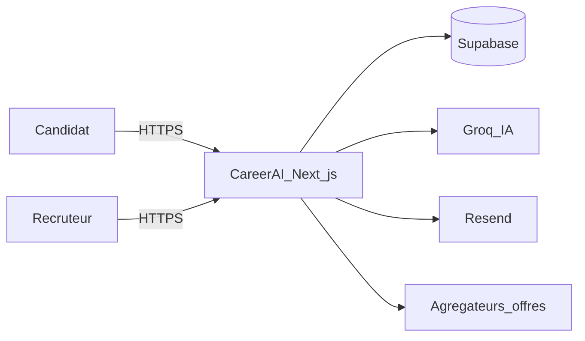
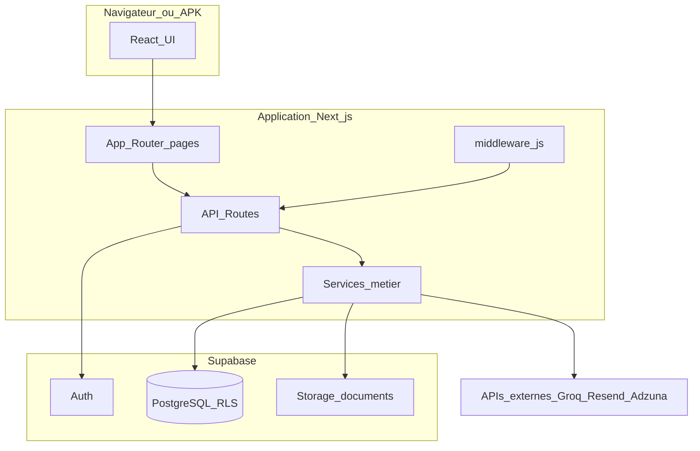
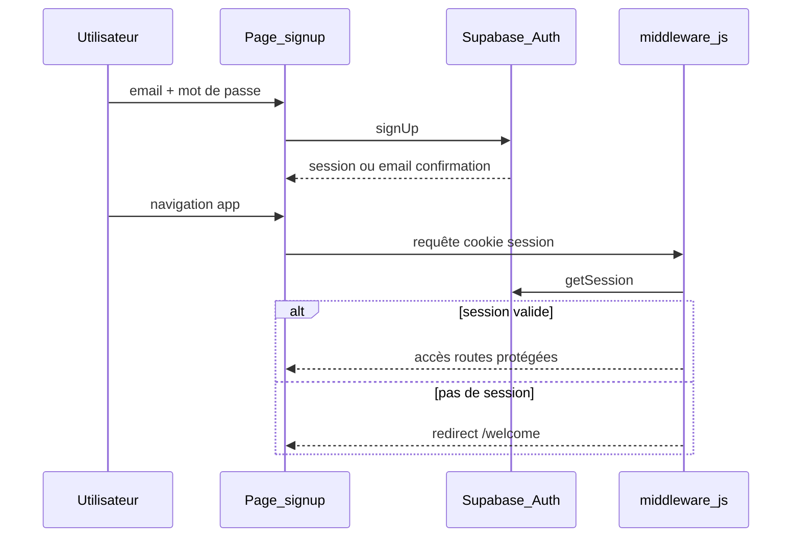
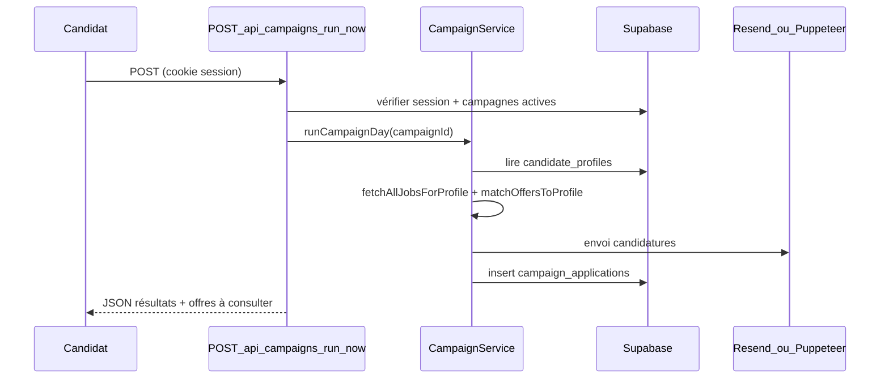

# C2.1 — Architecture logicielle

## 1. Pattern architectural retenu

**Monolithe modulaire full-stack Next.js 14** :

- **Couche présentation** : pages et composants React (`app/`, `frontend/components/`), marqués `'use client'` lorsque l’interactivité l’exige.
- **Couche API** : Route Handlers (`app/api/**/route.js`) — point d’entrée HTTP, validation session, orchestration.
- **Couche métier** : services (`backend/services/`, `app/lib/`) — logique réutilisable, appels externes, règles de campagne et scoring.
- **Couche données** : Supabase client (anon + service role selon le contexte), schéma SQL + RLS.

Ce pattern évite la dispersion de la logique métier dans les composants UI tout en gardant un seul artefact déployable.

---

## 2. Diagramme C4 — Niveau 1 (Contexte)



---

## 3. Diagramme C4 — Niveau 2 (Conteneurs)



---

## 4. Séquence — Authentification



Fichiers : [app/auth/signup/page.js](../app/auth/signup/page.js), [middleware.js](../middleware.js).

---

## 5. Séquence — Exécution campagne (run-now)



Fichiers : [app/api/campaigns/run-now/route.js](../app/api/campaigns/run-now/route.js), [backend/services/CampaignService.js](../backend/services/CampaignService.js).

---

## 6. Interfaces entre composants

### 6.1 UI → API (REST interne)

Le client utilise [frontend/lib/api.js](../frontend/lib/api.js) (`fetch` + cookies). Exemples :

| Méthode | Endpoint | Rôle |
|---------|----------|------|
| GET | `/api/campaigns` | Liste des campagnes |
| POST | `/api/campaigns` | Créer une campagne |
| POST | `/api/campaigns/run-now` | Exécution immédiate |
| POST | `/api/recruiter/candidates` | Ajouter candidat (multipart) |
| POST | `/api/recruiter/quizzes/{id}/send` | Envoyer quiz |

Spécification OpenAPI : [05-api-openapi.yaml](05-api-openapi.yaml).

### 6.2 API → Services

Les routes importent les services métier plutôt que d’implémenter la logique inline :

- `CampaignService.runCampaignDay` — orchestration campagne.
- `RankingService` — scores et classements recruteur.
- `chat.js` / `AIService` — appels Groq.

### 6.3 Services → Supabase

- **Client utilisateur** (`createRouteHandlerClient`) : opérations soumises au RLS.
- **Service role** (`SUPABASE_SERVICE_ROLE_KEY`) : cron, opérations admin limitées (upload storage recruteur, ranking).

---

## 7. Sécurité logicielle

| Mécanisme | Implémentation |
|-----------|----------------|
| Auth session | Cookies Supabase + middleware |
| RLS | Policies par `user_id` / `recruiter_id` |
| Secrets serveur | Variables `.env.local` uniquement côté Node |
| Cron | Header `Authorization: Bearer CRON_SECRET` |
| Quiz public | Token opaque dans URL, pas d’auth globale |

---

## 8. Scalabilité et performance

| Aspect | Approche |
|--------|----------|
| API stateless | Pas de session serveur Next ; scaling horizontal possible (Vercel/Render) |
| Plafonds métier | `max_applications_per_day`, durée campagne |
| Traitements longs | `maxDuration` sur routes campagne ; exécution asynchrone via cron |
| Traçabilité | Tables `campaign_runs`, `campaign_applications` |
| Cache | Pas de cache distribué V1 ; évolution possible (Redis) si volume |

---

## 9. Structure des répertoires

```
app/                    # App Router (pages + API)
  api/                  # 33 route handlers
  auth/                 # login, signup, etc.
frontend/
  components/           # UI React
  contexts/             # Auth, Toast, i18n
  hooks/                # useChat, etc.
backend/
  services/             # Logique métier lourde
  lib/                  # Utilitaires Supabase
supabase-migrations/    # Évolutions schéma
docs/                   # Documentation grille RNCP
```

---

## 10. Évolutions envisagées

- File d’attente (Bull/Redis) pour les envois de campagne en pic de charge.
- OpenAPI étendue à l’ensemble des 33 routes.
- Tests E2E (Playwright) sur parcours inscription et campagne.
